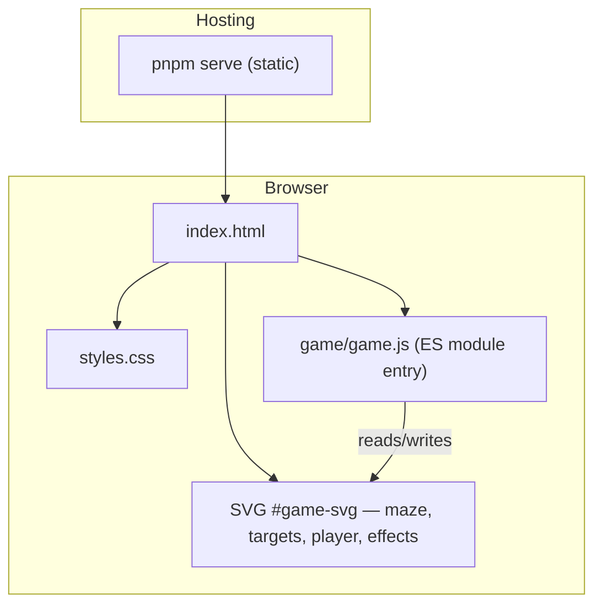
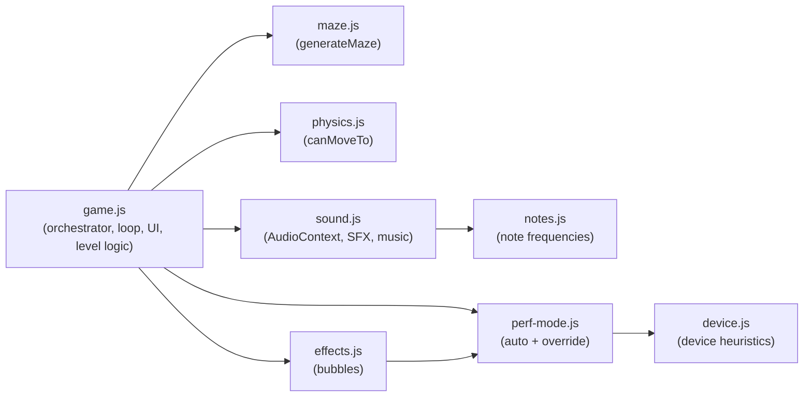
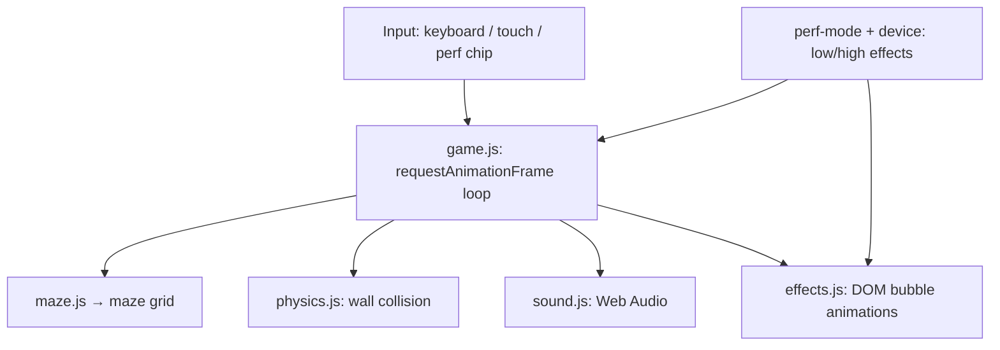

# Pipeline: The Undersea Maze

A browser-based underwater maze game. Guide your Octopus through the maze to navigate the depths and reach production!

[Play now!](https://pipeline.stevefenton.co.uk)


You'll encounter the jellyfish of hazards as you make your way through the maze. Try to avoid the hazards as your next DNS failure will send you back to the start. It will also increase your *change failure rate*. The goal is to score points with short *lead time for changes*, but can you achieve fast flow if you don't watch out for the hazards?

## Controls

Keyboard

- Arrow keys to move
- Space to use telescope

Touchscreen

- Touch to move (relative to center)
- Tap Octopus to use telescope

## Running locally

You can run the game easily on your local machine using `pnpm`.

1. Ensure you have Node.js and [pnpm](https://pnpm.io/) installed.
2. Install the project dependencies:

   ```bash
   pnpm install
   ```

3. Start the local development server:

   ```bash
   pnpm start
   ```

4. Open the local address provided in your terminal (usually `http://localhost:8080` or similar) in your web browser to play the game!

## Game internals

### High-level structure



### JavaScript modules



### Runtime responsibilities


